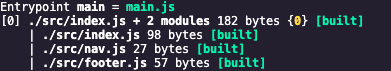

# Webpack - A tool to share code, manage dependencies and lessen pain

Webpack is a build tool for web applications and much more!

- npm adds a `bin` folder to `node_modules` that contains all the executbales of your dependencies
- `script` key in `package.json` allows to use the binaries (executables) from ^ in the scope of your project by hositing them in to the scope of your project

- Webpack has a `watch` mode. `npm run webpack -- --mode development --watch`.
- Webpack dependency graph:
  - 