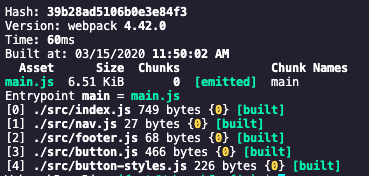

# Webpack - A tool to share code, manage dependencies and lessen pain

Webpack is a build tool for web applications and much more!

- npm adds a `bin` folder to `node_modules` that contains all the executbales of your dependencies
- `script` key in `package.json` allows to use the binaries (executables) from ^ in the scope of your project by hositing them in to the scope of your project

- Webpack has a `watch` mode. `npm run webpack -- --mode development --watch`.
- Webpack dependency graph:
  - 

## The built file

When we first run webpack with a webpack.config.js (mode: 'none') with no replacement to the default behaviour, terminal output looks like this:

-

- On cheking the built file, as of now `main.js`, we see an IIFE and as you scroll down close to where an array (of IIFEs) is passed into this IIFE and notice a `0`, `1`, `2`, `3`, `4` (in the part decorated with `/****/` and see `/* 0 */`) which correspond to the treminal output which corresponds to the modules!
